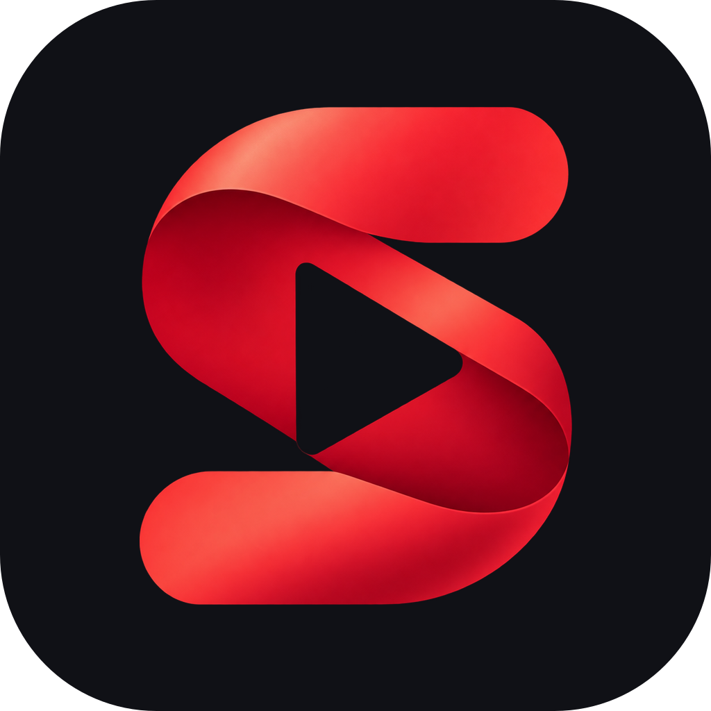
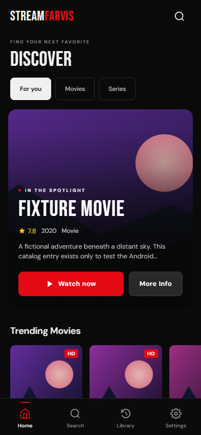
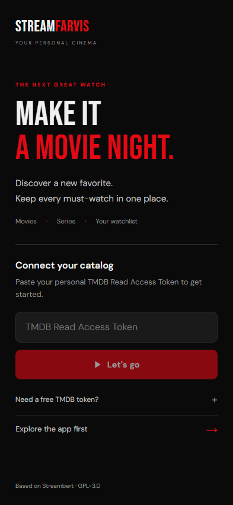

# StreamFarvis

An Android adaptation of [Streambert](https://github.com/truelockmc/streambert), with a movie and series catalog, a personal watchlist, and a native fullscreen player window.

[Download the latest APK](https://github.com/FloKuersten/StreamFarvis/releases/latest) · [Build from source](docs/DEVELOPMENT.md) · [Report a bug](https://github.com/FloKuersten/StreamFarvis/issues/new/choose)

  
  

*Phone browser previews. Discovery uses fictional test titles and artwork; these images do not demonstrate live provider playback.*

## Install

Requires **Android 7.0 or newer**, an up-to-date Android System WebView, and an internet connection for catalog and playback services.

1. Download `StreamFarvis-1.0.1-release.apk` from the [latest release](https://github.com/FloKuersten/StreamFarvis/releases/latest).
2. Open the APK on your phone. If Android prompts you, allow your browser or file manager to install apps from this source.
3. Launch StreamFarvis and enter your own **TMDB API Read Access Token**. The [token guide](tmdb-tutorial.md) explains how to get one. Use the long Read Access Token, not the shorter API key.
4. Browse or search for a title, choose a movie or episode, and tap **Open player**. Android Back returns to the app.

No shared TMDB token is included. You can explore the interface before adding a token; loading the catalog and searching require one. Release assets include a SHA-256 checksum for the APK. Updates must use an APK signed with the same key; a separately built APK may require uninstalling the existing app, which removes its local data.

## Features

- Movie and TV discovery, search, details, and season/episode selection using TMDB.
- Local watchlist, viewing history, and manual watched markers.
- Phone and tablet layouts, bottom navigation, and Android Back support.
- Third-party provider playback in a separate Android WebView, with fullscreen landscape video and popup blocking.
- Themes, accent colors, and catalog language preferences.
- TMDB token encryption backed by Android Keystore, plus in-app cache clearing and data reset.

## Current limits

This is an Android port of a desktop application. Desktop downloads, local-file playback, the AllManga resolver, automatic playback-progress tracking, automatic next-episode playback, picture-in-picture, Discord presence, and the desktop updater are not included. Anime uses TMDB metadata and the available standard providers.

Providers operate independently of StreamFarvis. Availability, video compatibility, subtitles, ads, and tracking can vary. Popup blocking does not reproduce Streambert's full desktop request-blocking engine. End-to-end playback across providers and physical Android devices has not been verified. Only access content you are entitled to watch.

## Development and support

See [development instructions](docs/DEVELOPMENT.md) for local builds, [Android notes](ANDROID.md) for implementation details, and the [design direction](docs/DESIGN.md) for the mobile UI reference and decisions. [Contributing](CONTRIBUTING.md) explains what to include in bug reports and pull requests. Report vulnerabilities privately using the [security policy](SECURITY.md).

The interface has been checked at phone, landscape, and tablet sizes. The [validation record](docs/VALIDATION.md) distinguishes browser fixtures, native emulator checks, and unverified playback scenarios. Release notes describe the checks performed for each APK and any remaining limitations.

## Credits and license

StreamFarvis is based on **Streambert 2.6.0** by **truelockmc and contributors**, starting from [commit `4afe564`](https://github.com/truelockmc/streambert/commit/4afe564e5ea2565c96d6f2e61679c00fad2d498c). It retains the upstream React interface, catalog, library, theme system, artwork, and provider URL generation. The original project documentation is preserved in [docs/UPSTREAM.md](docs/UPSTREAM.md).

Distributed under **GNU GPL v3**. See [LICENSE](LICENSE). Source code is available in this repository and in the corresponding release source archive.

This product uses the TMDB API but is not endorsed or certified by TMDB.
