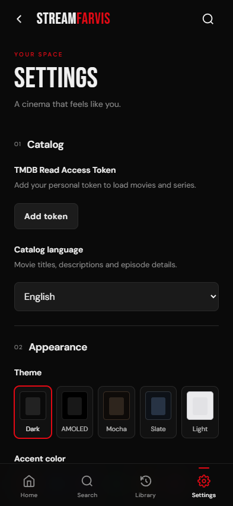

# Android design direction

StreamFarvis uses a cinematic dark interface: artwork leads, navigation stays quiet, and the primary watch action carries the accent color. The existing Bebas Neue display type, DM Sans body type, and red accent connect the Android app to its Streambert origins.

## Reference

The requested starting point was [TitanUI's mobile UI catalog](https://www.titanui.com/web-ui/mobile-ui/). The selected reference is [Mobile VR Store UI Design Figma by Taqwah](https://www.titanui.com/108700-mobile-vr-store-ui-design-figma/).

The reference preview was inspected directly. It is a light, purple-accented hardware store, with one dominant product image, sparse supporting text, a short category strip, unobtrusive bottom navigation, and a prominent primary action. Those layout principles fit browsing a media collection. StreamFarvis adapts them into its own dark streaming interface; the reference is not a streaming-app template.

No reference kit files, illustrations, fonts, or code were imported. The Android markup and styles are implemented in this repository, retaining the project's existing assets and GPL license.

## Decisions

- **App icon:** a coral-red folded S ribbon with a play-shaped opening on charcoal. Android adaptive, circular, legacy and themed icons share the same silhouette; the launch splash uses the same mark. Export sizes and source artwork are described in [the branding guide](../resources/branding/README.md).
- **Discovery:** a clear spotlight title and Watch now action, followed by horizontal poster rails. For you, Movies, and Series are working catalog filters.
- **Artwork:** large backdrops carry the visual emphasis. Dark overlays keep text legible; individual posters retain their portrait proportions.
- **Navigation:** a compact wordmark and search control above four persistent bottom destinations. A small accent marker identifies the selected destination.
- **Setup:** a brief introduction, one token input, and expandable instructions. Token requirements and the option to explore first remain explicit.
- **Details:** the backdrop establishes context, then the title, metadata, description, and primary action form a single reading order. Playback behavior is unchanged by the visual refresh.
- **Settings:** compact sections, a complete theme preview row, and existing accent/catalog-language controls. Theme surfaces and text still use the shared CSS variables.
- **Touch and motion:** controls keep at least 44-pixel targets; layouts account for Android safe areas, landscape, and tablets. Reduced-motion preferences suppress interface animation.

## Verification

The responsive fixture checks cover 393×852 and 360×800 phones, 844×390 landscape, and 768×1024 tablets. They check horizontal overflow, navigation, settings, filter behavior, and dialog/player Back handling. Documentation screenshots taken with fixture data are labeled accordingly; they demonstrate interface layout, not live catalog access or streaming success.

See [development instructions](DEVELOPMENT.md) for running the browser and Android checks, and the [validation record](VALIDATION.md) for native results.

  

*Settings in the phone browser preview.*
